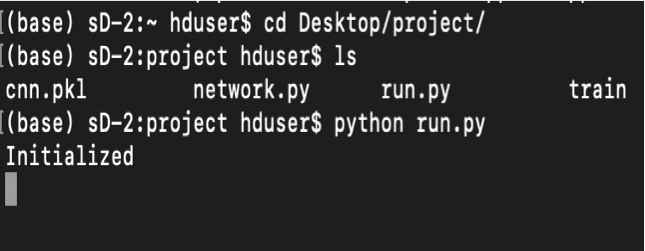
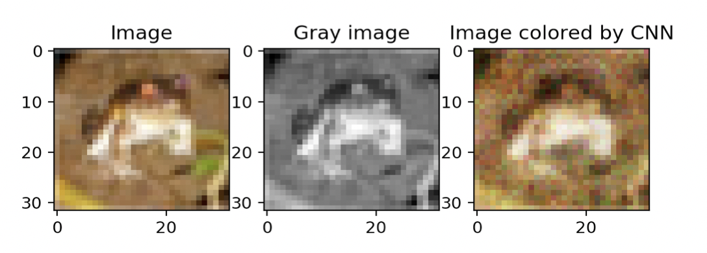
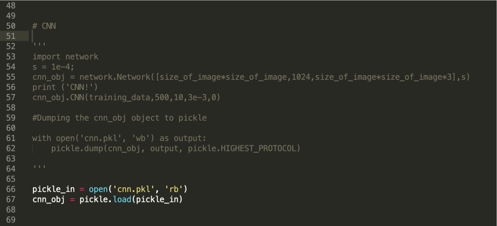
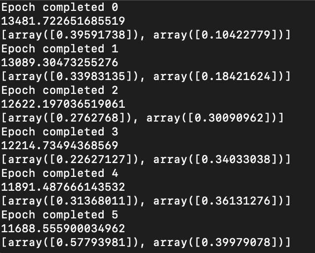

# *The coloration of black and white images using Convolutional Neural Network*

## Dataset
The “CIFAR-10” (https://www.kaggle.com/c/cifar-10/data) data set is used. Data set consists of 50000 images out of which 1000 are used for ease of computation. Images are 3D in the form of Length X Breadth X Channel, where channel represents the RGB colors.

The colored images and their grayscale are input for training. Model is tested on the gray counterpart. Error is evaluated based on the difference of original and colorized images matrices.

## How to Compile
The project is carried out in Python. So, it is necessary that python 3.x is installed. Follow the following steps to run the project: 
• Download the folder and using the terminal/command prompt, navigate to the project directory For example: cd Desktop/project 
• Once you are in the folder, execute the following command: python run.py 

     
This should successfully run the code with output displayed like:

     

### <ins>NOTE:</ins>   
Since the training of model takes considerable amount of time, model is trained and the optimized parameters are dumped in ‘cnn.pkl’ file. Hence, the training part is commented out in the ‘run.py’ file and optimized parameters are directly loaded from the ‘cnn.pkl’ pickle file.
  
Creating object of ‘Network’ class and training the model:

  
While training:

